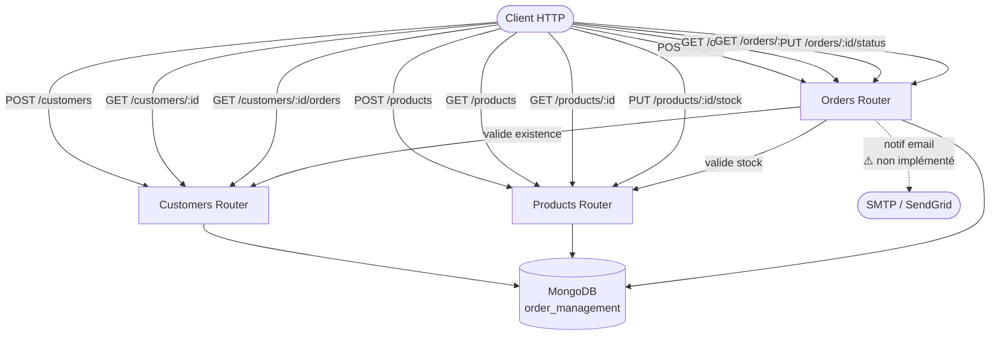
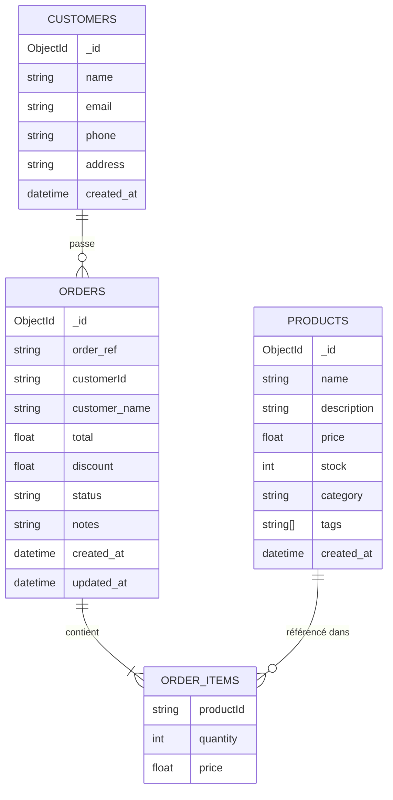
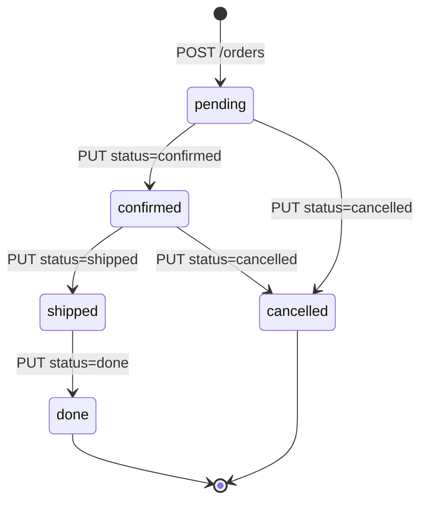

# Order Management API — Vue d'ensemble

Une API REST de gestion de commandes construite avec **FastAPI** + **MongoDB**.

---

## Architecture globale



---

## Collections MongoDB



---

## Toutes les actions disponibles

### Customers `/customers`

| Méthode | Route | Action |
|---------|-------|--------|
| `POST` | `/customers` | Créer un client (email unique) |
| `GET`  | `/customers/{id}` | Récupérer un client |
| `GET`  | `/customers/{id}/orders` | Récupérer le client + toutes ses commandes |

**Exemple — créer un client**
```json
POST /customers
{
  "name": "Alice Dupont",
  "email": "alice@example.com",
  "phone": "0600000000",
  "address": "12 rue de la Paix, Paris"
}
```

---

### Products `/products`

| Méthode | Route | Action |
|---------|-------|--------|
| `POST` | `/products` | Créer un produit |
| `GET`  | `/products?category=X` | Lister les produits (filtre optionnel par catégorie) |
| `GET`  | `/products/{id}` | Récupérer un produit |
| `PUT`  | `/products/{id}/stock?quantity=N` | Ajuster le stock (N peut être négatif) |

**Exemple — créer un produit**
```json
POST /products
{
  "name": "Clavier mécanique",
  "description": "Cherry MX Red",
  "price": 89.99,
  "stock": 50,
  "category": "informatique",
  "tags": ["gaming", "bureau"]
}
```

---

### Orders `/orders`

| Méthode | Route | Action |
|---------|-------|--------|
| `POST` | `/orders` | Créer une commande |
| `GET`  | `/orders?status=X` | Lister les commandes (filtre optionnel par statut) |
| `GET`  | `/orders/{id}` | Récupérer une commande |
| `PUT`  | `/orders/{id}/status` | Mettre à jour le statut |

**Exemple — créer une commande**
```json
POST /orders
{
  "customerId": "664f1a...",
  "items": [
    { "productId": "664f2b...", "quantity": 3, "price": 89.99 }
  ],
  "notes": "Livraison urgente"
}
```

---

## Cycle de vie d'une commande



> ⚠️ La validation des transitions est définie dans `utils.py` mais **pas encore branchée** dans la route.

---

## Logique métier clé

### Remise automatique sur volume
Lors de la création d'une commande, si le **nombre total d'articles ≥ 10**, une remise de **10 %** est appliquée automatiquement sur le total.

```
total_items = somme des quantités
si total_items >= 10 → discount = total × 0.10
```

### Validation à la création d'une commande
1. Vérifie que le **client existe** en base
2. Vérifie que le **stock est suffisant** pour chaque produit
3. Calcule le total + remise éventuelle
4. Génère une référence unique `ORD-XXXXXXXX`

---

## Endpoints utilitaires

| Méthode | Route | Action |
|---------|-------|--------|
| `GET` | `/` | Message de bienvenue |
| `GET` | `/health` | Health check → `{"status": "ok"}` |

---

## Stack technique

| Composant | Technologie |
|-----------|-------------|
| Framework | FastAPI |
| Serveur   | Uvicorn |
| Base de données | MongoDB |
| Validation | Pydantic |
| Connexion DB | pymongo |
| Config | python-dotenv |

---

## Points d'amélioration identifiés dans le code

- [ ] Notifications email non implémentées (`helpers.py` → stub)
- [ ] Transitions de statut définies mais non appliquées dans la route
- [ ] Double connexion MongoDB (à consolider)
- [ ] Pas d'authentification / autorisation
- [ ] URI MongoDB hardcodée (à passer en variable d'environnement)
